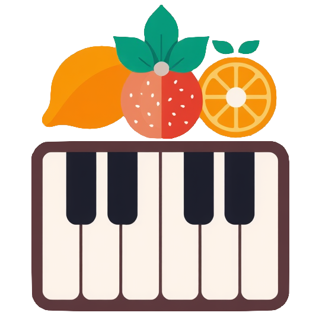

<b>THIS README IS WIP SO IT WILL BE CHANGED SOON</b>

[![Contributors][contributors-shield]][contributors-url]
[![Forks][forks-shield]][forks-url]
[![Stargazers][stars-shield]][stars-url]
[![Issues][issues-shield]][issues-url]
[![License][license-shield]][license-url]

 

  

<h3 align="center">FruityScale</h3>

  

    A smart companion application that analyzes your FL Studio Piano Roll notes to instantly identify matching musical scales.
     
    <a href="https://github.com/3060s/FruityScale"><strong>Explore the docs »</strong></a>
     
     
    <a href="https://github.com/3060s/FruityScale">View Demo</a>
    &middot;
    <a href="https://github.com/3060s/FruityScale/issues/new?labels=bug&template=bug-report---.md">Report Bug</a>
    &middot;
    <a href="https://github.com/3060s/FruityScale/issues/new?labels=enhancement&template=feature-request---.md">Request Feature</a>
  

  
Table of Contents

  <ol>
    <li>
      <a href="#about-the-project">About The Project</a>
      <ul>
        <li><a href="#built-with">Built With</a></li>
      </ul>
    </li>
    <li><a href="#getting-started">Getting Started</a></li>
    <li><a href="#usage">Usage</a></li>
    <li><a href="#roadmap">Roadmap</a></li>
    <li><a href="#contributing">Contributing</a></li>
    <li><a href="#license">License</a></li>
    <li><a href="#contact">Contact</a></li>
  </ol>

## About The Project

FruityScale is a desktop application designed to bridge the gap between your DAW and music theory. It currently integrates with FL Studio via a lightweight, internal script. 

With just few clicks, FruityScale retrieves note data directly from your current Piano Roll and instantly analyzes which musical scales those notes belong to. It is a quick and seamless way to stay in key, analyze complex chords, or figure out where to take your melodies next.

(<a href="#readme-top">back to top</a>)

### Built With

* [![C#][CSharp-shield]][CSharp-url]
* [![.NET][DotNet-shield]][DotNet-url]
* [![AvaloniaUI][Avalonia-shield]][Avalonia-url]

> **Note:** This project also utilizes **Serilog** for robust logging and **xUnit** for comprehensive unit testing.

(<a href="#readme-top">back to top</a>)

## Getting Started

Currently, FruityScale is distributed as pre-compiled, ready-to-run executables for major operating systems. You do not need to build the project from source unless you want to contribute.

To get started:
1. Head over to the **[Releases](https://github.com/3060s/FruityScale/releases)** page.
2. Download the latest version corresponding to your operating system.
3. Extract and run the application.

*(Detailed installation instructions and FL Studio script setup guide will be added in future releases).*

(<a href="#readme-top">back to top</a>)

## Usage

1. Open your project in FL Studio and add some notes to the Piano Roll.
2. Run the provided FruityScale internal script inside FL Studio.
3. Open the FruityScale desktop app and click the fetch button.
4. The application will instantly display all compatible musical scales based on your notes.

(<a href="#readme-top">back to top</a>)

## Roadmap

- [x] Initial FL Studio script integration
- [x] One-click note data fetching
- [x] Basic scale matching algorithm
- [ ] Support for other popular DAWs (Ableton, Logic Pro, Reaper, etc.)
- [ ] Advanced analysis tools and extended chord detection
- [ ] Experimental: Live MIDI input tracking with real-time scale detection

See the [open issues](https://github.com/3060s/FruityScale/issues) for a full list of proposed features (and known issues).

(<a href="#readme-top">back to top</a>)

## Contributing

Contributions are what make the open-source community such an amazing place to learn, inspire, and create. Any contributions you make are **greatly appreciated**.

If you have a suggestion that would make this better, please fork the repo and create a pull request. You can also simply open an issue with the tag "enhancement".
Don't forget to give the project a star! Thanks again!

1. Fork the Project
2. Create your Feature Branch (`git checkout -b feature/AmazingFeature`)
3. Commit your Changes (`git commit -m 'Add some AmazingFeature'`)
4. Push to the Branch (`git push origin feature/AmazingFeature`)
5. Open a Pull Request

(<a href="#readme-top">back to top</a>)

### Top contributors:

## License

Distributed under the GPL-3.0 License. See `LICENSE.txt` for more information.

(<a href="#readme-top">back to top</a>)

## Contact

Project Link: [https://github.com/3060s/FruityScale](https://github.com/3060s/FruityScale)

(<a href="#readme-top">back to top</a>)

[contributors-shield]: https://img.shields.io/github/contributors/3060s/FruityScale.svg?style=for-the-badge
[contributors-url]: https://github.com/3060s/FruityScale/graphs/contributors
[forks-shield]: https://img.shields.io/github/forks/3060s/FruityScale.svg?style=for-the-badge
[forks-url]: https://github.com/3060s/FruityScale/network/members
[stars-shield]: https://img.shields.io/github/stars/3060s/FruityScale.svg?style=for-the-badge
[stars-url]: https://github.com/3060s/FruityScale/stargazers
[issues-shield]: https://img.shields.io/github/issues/3060s/FruityScale.svg?style=for-the-badge
[issues-url]: https://github.com/3060s/FruityScale/issues
[license-shield]: https://img.shields.io/github/license/3060s/FruityScale?style=for-the-badge
[license-url]: https://github.com/3060s/FruityScale/blob/main/LICENSE

[CSharp-shield]: https://img.shields.io/badge/c%23-%23239120.svg?style=for-the-badge&logo=c-sharp&logoColor=white
[CSharp-url]: https://learn.microsoft.com/en-us/dotnet/csharp/
[DotNet-shield]: https://img.shields.io/badge/.NET-512BD4?style=for-the-badge&logo=dotnet&logoColor=white
[DotNet-url]: https://dotnet.microsoft.com/
[Avalonia-shield]: https://img.shields.io/badge/AvaloniaUI-33A3E3?style=for-the-badge&logo=dotnet&logoColor=white
[Avalonia-url]: https://avaloniaui.net/
